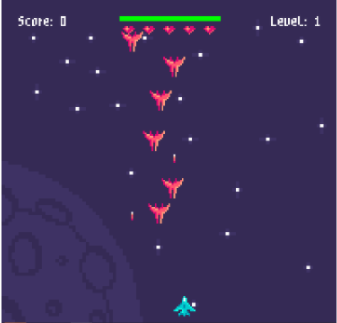

# Astralis
This is a 2D game, inspired by the popular Space Invaders arcade game, has a central theme of space and aliens. Objective of the game is to defend against aliens from trying to pass through to the bottom of the screen. There will be waves of increasing difficulty to challenge the player, as well as a score counter to compare against highscores.

## Screenshots

## Status
Project is: _finished_

## Inspiration
Project inspired by Space Invaders, and is expanded off of Tech With Tim's youtube tutorial https://www.youtube.com/watch?v=Q-__8Xw9KTM&ab_channel=TechWithTim
